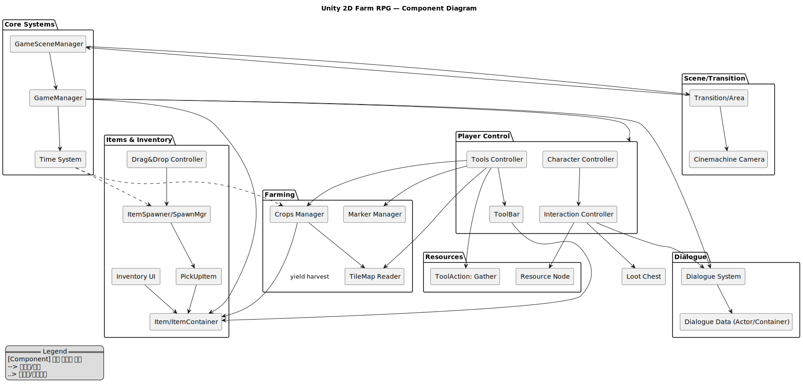

# 📌 개요 (Overview)

프로젝트명: Unity 2D Farm RPG (농사·채집·대화 프로토타입)   
한 줄 소개: “타일 기반 농사 + 자원 채집 + 대화 시스템을 데이터 주도 설계(ScriptableObject)로 모듈화하고, 툴바/인벤토리/타임 시스템으로 플레이 루프를 완성한 2D 탑다운 RPG입니다.”

## 🎯 설계 목표

* 플레이 루프 완결성: 이동→상호작용→농사/채집→아이템 수집→인벤토리/툴 사용→성장/대화→지역 이동까지 한 줄로 이어지는 루프.
* 데이터 주도 설계: 작물/아이템/배우(Actor)/대화 등은 ScriptableObject로 정의해 에디터 친화적(디자이너 협업 용이).
* 모듈화 & 확장성: 툴 액션(`ToolAction`)·타일 읽기(`TileMapReadController`)·자원 노드(`ResourceNode`)·시간 이벤트(`TimeAgent`)를 분리해 신규 기능을 덜 건드리고 추가.
* UX 우선 동작: 하이라이트·툴바 휠 전환·아이템 자동 흡수·드래그&드랍 등 손맛/가시성을 챙김.
* 안정적인 씬 전환: Additive Scene + Cinemachine OnTargetObjectWarped로 워프/씬 이동 시 카메라 튀는 현상 최소화.

## 🧭 핵심 플레이 루프

1. 탐색/이동: 방향키/WSAD로 이동, 마지막 이동 방향은 애니메이터 파라미터로 유지
2. 상호작용: 시야 전방 영역 원형 탐지 → `Interactable` 하이라이트/실행
3. 툴 사용(월드): 툴바 선택 → `ToolAction.OnApply()`로 주변 오브젝트 타격 (예: 나무 벌목)
4. 툴 사용(타일): 선택 타일(`Marker`)에 Plow/Seed 적용 → `CropsManager` 성장 진행
5. 아이템 루프: 드랍 → `PickUpItem` 자동 흡수 → `ItemContainer` 저장 → 툴바로 사용/월드 재드랍
6. 대화: NPC 상호작용 → `DialogueSystem`(타이핑 효과+초상화)
7. 시간: `TimeAgent` 구독 → 작물 성장 Tick/랜덤 아이템 스폰
8. 지역 이동: `Transition/TransitionArea`로 워프/씬 전환, 플레이어 위치/카메라 자연스러운 보정

## 🧩 아키텍처 하이라이트

* Core Singletons: `GameManager`(전역 참조), `ItemSpawnManager`(월드 드랍), `GameSceneManager`(씬 스위칭)
* Event 기반 시간 흐름: `TimeAgent`가 `DayTimeController` 구독 → onTimeTick에 작물 성장/스폰 처리
* 툴 파이프라인
  * 월드 오브젝트: `ToolAction.OnApply(worldPoint)` → `UsingTool`(ex. `ResourceNode`)
  * 타일 액션: `ToolAction.OnApplyToTileMap(gridPos, TileMapReadController, Item)` → `CropsManager`
  * 공통 소비 훅: `OnItemUsed(item, inventory)`로 내구도/소모품/쿨다운 같은 규칙 확장 용이
* 타일 기반 상호작용: `TileMapReadController`가 스크린/월드 좌표→타일 좌표 변환, `MarkerManager`가 선택 타일 하이라이트
* UX 디테일: 휠 스크롤로 툴바 인덱스 순환, `HighlightController`로 상호작용 타겟 시각화, `PickUpItem` 자기 유도 + TTL 관리

## 🔮 향후 개선 방향

* 게임 플레이 확장: 퀘스트/스토리 추가, 몬스터 전투 등 RPG 요소 확대
* 데이터 주도 설계: ScriptableObject 기반 DB를 확장해 더 많은 아이템/작물/NPC 관리
* 세이브/로드 시스템: 플레이어 상태, 인벤토리, 월드 시간 저장/복원
* UI 고도화: 인벤토리 정렬, 아이템 툴팁, 대화 분기 시스템

---
Read more
- [Features](./docs/features.md)
- [Architecture](./docs/architecture.md)
- [Code Snippets](./docs/code-snippets.md)
- [Screenshots](./docs/demo.md)
