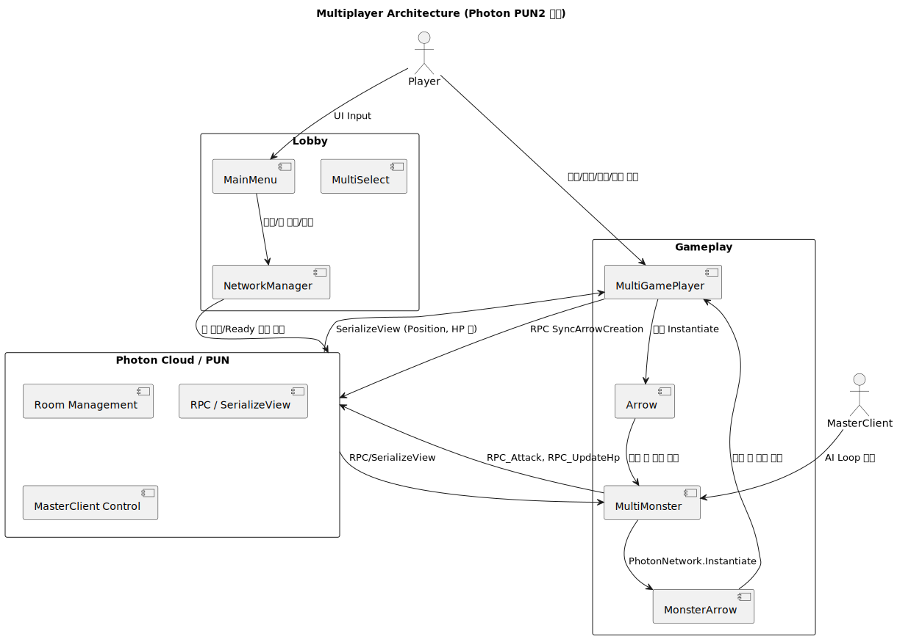

# 🎮 Unity Multiplayer Game Project - Lakemir

## 📌 개요

이 프로젝트는 Photon PUN2를 기반으로 한 2D 액션 멀티플레이 프로토타입입니다.
로비에서 방 생성·참여·준비(Ready) 과정을 거쳐 멀티 씬으로 진입하면, 플레이어 이동/점프/대쉬/공격 상태가 네트워크로 동기화되고, 마스터 클라이언트가 몬스터 AI/투사체를 단일 권한으로 관리합니다.

이번 작업은 제가 처음으로 멀티플레이를 설계·구현해 본 프로젝트로, 단순히 기능을 붙이는 수준을 넘어 다음과 같은 핵심 설계 결정을 직접 시도했습니다.

* 권한(Authority) 모델 수립

  * 플레이어는 각 오브젝트 소유자(Owner)가 입력과 상태 변경을 주도하고, OnPhotonSerializeView로 주기 상태를 스트리밍합니다.
  * 몬스터/보스는 MasterClient 단일 권한으로 AI·패턴·투사체 생성을 수행하고, \[PunRPC]로 이벤트를 전파합니다.

* 상태 동기화 전략 분리

  * 연속 상태(위치/회전/이동 여부)는 SerializeView + LERP 보간으로 시각적 끊김을 최소화합니다.
  * 불연속 이벤트(점프/대쉬/공격 트리거)는 \[PunRPC]로 최소 페이로드를 전송합니다.

* 투사체 복제 정책 차등화

  * 플레이어 화살: 로컬 Instantiate + Others RPC 복제 (비용이 적고 반응성 우선)
  * 몬스터 화살: 네트워크 Instantiate (마스터 권한 하에 일관성 우선)

* 씬 동기화

  * PhotonNetwork.AutomaticallySyncScene = true 설정으로, 마스터가 씬 전환 시 전체 클라이언트가 동일하게 동기화됩니다.

이러한 구조적 시도를 통해, 첫 멀티플레이 구현임에도 불구하고 네트워크 품질과 게임 플레이 경험(입력 반응성, 애니메이션 싱크 등) 사이에서 균형을 잡으려 노력했습니다. 아직 부족한 부분도 있지만, 이를 통해 멀티플레이 네트워킹의 기초를 직접 설계하고 구현해 본 경험을 쌓을 수 있었습니다.

---

## ✨ 주요 기능 (상세)

### 1) 로비/매치메이킹 & 멀티 시작 플로우

* 방 생성/참여/리스트 갱신: NetworkManager가 OnRoomListUpdate()로 방 목록을 유지하고, 페이지 네이션으로 UI에 표시
* 준비(Ready) 동기화: \[PunRPC] UpdateReadyStatus로 개별 준비 상태를 전원에 전파, 전원이 Ready일 때만 게임 시작 가능
* 씬 전환 동기화: 마스터가 PhotonNetwork.LoadLevel(...) 호출 시 전체 클라이언트가 동일하게 씬 전환
* 멀티 시작 UI 흐름: MainMenu/MultiSelect를 통해 닉네임 입력 → 모드 선택 → 방 진입 → Ready → 씬 로드까지 자연스러운 UX 구현

### 2) 멀티플레이어 동기화

* 입력 처리 & 권한 관리: photonView\.IsMine일 때만 이동/점프/대쉬/공격 입력을 반영
* 상태 스트리밍: HP/Shield/Position/Direction/공격 플래그를 SerializeView로 송수신, 비소유자 클라이언트는 LERP 보간 적용
* 이벤트 RPC: SyncJumpState, SyncDashState, Sync(Attack) 등 트리거성 이벤트를 RPC로 전파
* 원거리 공격: 로컬 입력 시 즉시 발사 + Others에 동일 파라미터를 RPC로 복제 → 반응성과 시야 일관성 확보

### 3) 몬스터/보스

* MasterClient 전용 AI 루프: 추적/공격/사망 상태를 마스터가 결정, RPC\_UpdateHp/Destroy로 결과 전파
* 보스 특수 패턴: \[PunRPC] SpawnBossHand로 네트워크 Instantiate → 보스 핸드 오브젝트가 자체 생명주기 후 RPC로 파괴
* 분열형 몬스터: 사망 시 miniMonster 2기 생성 후 자신 제거

### 4) 투사체

* 플레이어 화살: 로컬 이동/가이딩, 충돌 시 몬스터 HP 감소 요청
* 몬스터 화살: 네트워크 Instantiate, 충돌 시 플레이어 피해 처리

---

## 🧭 제가 설계·개발한 영역

* 멀티플레이 코어 설계

  * 권한 모델(Owner vs MasterClient) 정의
  * 상태/이벤트 동기화 전략 수립 및 보간 처리 적용
* 멀티 시작 플로우 UI 구축

  * 닉네임/모드/방/Ready/씬 진입까지의 흐름을 UI와 함께 엔드-투-엔드 설계
* 플레이어 조작 & 전투 베이스 구현

  * 이동/점프/대쉬/근·원거리/실드 공격 입력 처리 및 동기화
  * 로컬-우선 발사 + Others 복제 구조로 반응성과 일관성 균형 확보
* 네트워크 품질 고려

  * SerializeView 전송 필드 최소화 및 이벤트화
  * 투사체 복제 방식을 목적별(로컬 vs 네트워크)로 분리 설계

---

## 🏗 아키텍처

* Lobby → NetworkManager → MultiSelect → MultiGamePlayer → Monsters
* 플레이어(Owner): 입력 처리 → 상태 송신(SerializeView) + 이벤트 전파(RPC)
* 몬스터(MasterClient): AI/투사체/HP 결정 → 결과 브로드캐스트(RPC/SerializeView)
* 투사체: 플레이어 = 로컬 복제, 몬스터 = 네트워크 Instantiate

📊 다이어그램:


---

## 📂 프로젝트 구조

```
Scripts/
 ┣ Lobby/              # 로비 UI, NetworkManager, Save/Load, MultiSelect
 ┣ Main_Game/
 ┃ ┣ MultiPlay/Player/ # MultiGamePlayer(동기화/입력), MultiCamaraControl
 ┃ ┣ Monster/Multi/    # MultiMonster(마스터 권한 AI), Boss, Split, Arrows
 ┃ ┗ Weapon/           # 근거리/원거리/실드
 ┣ ENUM/               # Direction/AttackKey/Effect 등 공용 ENUM
 ┗ System/             # Singleton 유틸
```

---

## 🛠 기술 스택

* Engine/Language: Unity, C#
* Networking: Photon PUN2 (IPunObservable, \[PunRPC], PhotonView, MasterClient)
* Patterns: Owner/Authority 모델, SerializeView vs RPC 분리, Singleton 유틸
* Gameplay: Animator 상태머신, 위치/애니메이션 보간, Prefab 기반 관리

---

## 💻 대표 코드 스니펫 (제가 구현한 부분 중심)

### 1) 점프 동기화

```csharp
void Jump() {
    if (jumpCount < maxjump) {
        anit.SetTrigger("isJumping");
        rb.velocity = new Vector3(rb.velocity.x, 0, 0);
        rb.AddForce(Vector2.up * 400);
        jumpCount++;

        // 트리거 이벤트는 RPC로 전파
        photonView.RPC("SyncJumpState", RpcTarget.Others, jumpCount);
    }
}
```

### 2) 상태 스트리밍 + 보간

```csharp
public void OnPhotonSerializeView(PhotonStream stream, PhotonMessageInfo info) {
    if (stream.IsWriting) {
        stream.SendNext(currentHp);
        stream.SendNext(currentShield);
        stream.SendNext(transform.position);
        // ...
    } else {
        currentHp = (int)stream.ReceiveNext();
        currentShield = (int)stream.ReceiveNext();
        targetPosition = (Vector3)stream.ReceiveNext();
        // 보간 처리
        transform.position = Vector3.Lerp(transform.position, targetPosition, Time.deltaTime * positionLerpSpeed);
    }
}
```

### 3) 원거리 공격 발사/복제

```csharp
// 로컬 즉시 발사
CreateArrow(spawnPos, dir, dmg, weaponDamage, effect, guided);

// Others 복제
photonView.RPC("SyncArrowCreation", RpcTarget.Others,
    spawnPos, dir, dmg, weaponDamage, effect, guided);
```

---

## 🎥 시연 영상

* [게임 플레이 데모](https://youtu.be/LaYTojuuVZ0) – 로비 → 방 입장 → Ready → 멀티 전투
* [부하/동기화 데모](https://youtu.be/05-56TYfodA) – 투사체 및 애니메이션 싱크 관찰

---

## 🔮 향후 개선

* 권한 일관성 강화 (데미지/상태는 Master 또는 Owner 단일 처리)
* 네트워크 최적화 (SerializeRate/Delta Sync, 비트 패킹)
* Player/Room CustomProperties 활용해 Ready 관리 단순화
* 스냅샷/리플레이 기능 도입으로 중도 합류 플레이어 지원
