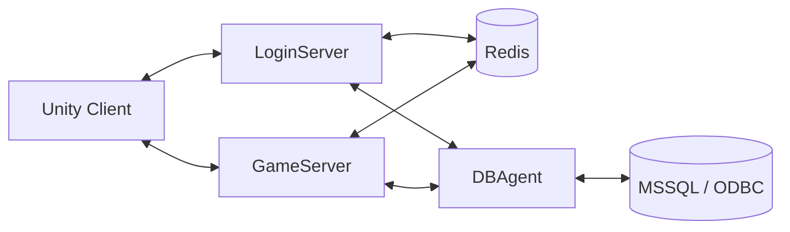
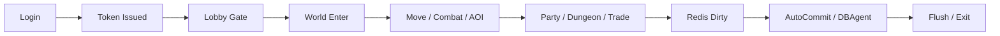

# 🎮 MMO Nexus Server Engine

## 📌 개요

이 프로젝트는 `LoginServer`, `GameServer`, `DBAgent`, `Unity Client`를 분리해 구성한 **C++ IOCP 기반 MMORPG 서버 프로젝트**입니다.
단순히 기능을 붙이는 수준이 아니라, 로그인부터 월드 입장, 이동·전투, 파티·던전·거래, 저장과 종료까지 이어지는 핵심 플레이 흐름을 **서버 권위, 정합성, 관측 가능성** 관점에서 직접 설계하고 구현했습니다.

이번 작업에서 특히 중요하게 가져간 기준은 "기능이 동작하는가"보다 **동시 입력, 비동기 DB 응답, 저장 지연, 예외 상황에서도 상태가 일관되게 수렴하는가**였습니다. 그래서 프로젝트 전반을 다음 네 가지 축으로 정리했습니다.

* **서버 권위 판정**
  * 클라이언트 입력은 제안으로만 받고, 이동·전투·맵 전이·거래 확정은 서버가 최종 판정합니다.
  * 검증을 통과한 상태만 월드에 반영하고, 그 결과만 주변 플레이어와 DB에 전파합니다.

* **Actor/JobQueue 기반 직렬화**
  * 네트워크 스레드가 게임 상태를 직접 수정하지 않고, `Session`, `LobbyRoom`, `GameRoom`, `PartyActor`, `InstanceActor`의 작업 큐로 위임합니다.
  * 룸·파티·인스턴스 단위의 상태 반영 순서를 고정해 동시성 복잡도를 줄였습니다.

* **Redis Write-Back + DBAgent 트랜잭션**
  * 실시간 플레이 중 변경 사항은 Redis Dirty 기준으로 누적하고, `AutoCommit` 워커와 `DBAgent`가 DB 반영을 분리해서 처리합니다.
  * 거래처럼 정합성이 중요한 흐름은 메모리 시뮬레이션과 DB 원자 커밋을 묶어 부분 반영을 막았습니다.

* **관측/부하 검증**
  * `Prometheus`, `Grafana` 기반 메트릭 수집과 대시보드를 구성했고, `DummyClient`로 부하 시나리오를 자동 재현할 수 있게 만들었습니다.
  * 단순 접속 수치가 아니라 queue wait, packet ingress, session TX, DB pool wait 같은 운영 지표로 구조의 효과를 해석할 수 있게 했습니다.

---

## ✨ 주요 기능 (상세)

### 1) 로그인/토큰/월드 입장 게이트

* `LoginServer`가 로그인 요청을 받아 계정 조회를 수행하고, 성공 시 Redis에 TTL 기반 입장 토큰을 발급합니다.
* `GameServer`는 `C_ENTER_GAME` 단계에서 토큰을 다시 검증한 뒤, 세션에 `Pending Enter` 컨텍스트를 고정합니다.
* `LobbyRoom`이 `stat`, `items`, `quickslot` 3종 로딩 상태를 별도로 추적하고, **셋이 모두 준비된 경우에만** 실제 월드 입장을 확정합니다.
* 로딩 실패나 잘못된 진입은 `S_ENTER_GAME(false)`와 세션 정리 경로로 수렴시켜, 반쯤 로딩된 상태가 월드에 들어가지 않도록 설계했습니다.

### 2) 월드/채널/인스턴스/맵 변경 핸드셰이크

* `RoomKey(channelId, mapId, instanceId)` 기준으로 월드 룸과 인스턴스 룸을 관리합니다.
* 채널별 `LobbyRoom`, 일반 월드용 `GameRoom`, 파티 전용 `Instance`를 분리해 구조를 단순화했습니다.
* 맵 변경은 토큰 발급 → `MapChanging` 상태 전이 → ACK 검증 → 룸 이동 순서로 처리해 중복 전이와 잘못된 ACK를 막았습니다.
* 던전 입장은 `PartyActor`와 `InstanceActor`를 통해 파티 단위로 전개하고, 강퇴·해산·인스턴스 종료 시에도 안전 귀환 경로로 수렴시켰습니다.

### 3) 서버 권위 이동 검증 + AOI/SpatialGrid

* `C_MOVE`는 룸 액터 큐로 직렬화한 뒤, `seq`, `dt`, 속도, 지형 충돌을 고정 순서로 검증합니다.
* 비정상 좌표나 역순 패킷은 즉시 드롭하고, 속도 초과 요청은 clamp, 충돌 경계는 NavMesh 기반 slide/correct 보정으로 처리합니다.
* 최종적으로 `ValidateMove`를 통과한 좌표만 서버 권위 위치로 커밋하고, 그 결과만 `S_MOVE`로 전파합니다.
* 시야 동기화는 `SpatialGrid`와 connectivity 필터를 이용해 가시 대상을 계산하고, `S_SPAWN`/`S_DESPAWN`을 배치와 스냅샷 경계로 나눠 전송합니다.

### 4) 전투/투사체/몬스터 AI/드랍

* 즉발, 원형, 부채꼴, 투사체 스킬을 서버가 직접 판정하고, 쿨타임도 서버 기준으로 검증합니다.
* 투사체는 속도, 수명, 사거리, 히트 반경, 관통 여부를 런타임 상태로 관리하고, 벽 충돌과 피격 처리도 서버에서 확정합니다.
* 몬스터는 `Idle`, `Chase`, `Attack`, `Return` 상태를 가진 FSM으로 동작하며, NavMesh 경로 추적과 LOS 기반 추격 최적화를 적용했습니다.
* `MonsterTemplates`, `SpawnTables`, `DropTables`를 로드해 몬스터 스폰, 리젠, 드랍 그룹 롤링까지 이어지는 전투 루프를 구성했습니다.

### 5) 파티/인스턴스 던전/거래/인벤토리·퀵슬롯

* 파티 생성, 초대, 수락/거절, 탈퇴, 강퇴, 해산과 파티 채팅, 상태 스냅샷을 구현했습니다.
* 이름 기반 초대는 온라인 이름 인덱스와 TTL 초대장 구조를 사용해 동명이인과 지연 수락 문제를 줄였습니다.
* 거래는 `Invited -> Active -> Locked -> Committing` 상태 머신으로 관리하고, `Ready`와 `Confirm`을 분리해 수정 가능 구간과 확정 구간을 명확히 나눴습니다.
* 인벤토리, 장비, 퀵슬롯 데이터는 로딩·저장·거래 검증과 연결되며, 장착 중 아이템 차단, 슬롯 재할당, 골드 검증까지 서버에서 다시 확인합니다.

### 6) 영속화/모니터링/부하 검증

* 플레이 중 변경 사항은 Redis에 Dirty 기준으로 누적하고, `AutoCommit` 워커가 플레이어 코어, 인벤토리, 퀵슬롯 저장 요청을 분리 전송합니다.
* 접속 종료 시 `RequestFlushNow` 경로를 통해 다음 주기를 기다리지 않고 즉시 저장을 요청해 종료 직전 변경분 손실을 줄였습니다.
* `Prometheus` exporter와 `GameMetrics`, `DBAgentMetrics`를 연결해 packet, lobby wait, S2S RTT, queue wait, session I/O, DB pool 지표를 수집합니다.
* `DummyClient`는 `idle`, `move`, `combat`, `mix` 시나리오와 CCU 램프업을 자동 실행해, 구조 변경 전후를 같은 기준으로 비교할 수 있게 했습니다.

---

## 🧭 제가 설계·개발한 영역

* **멀티 서버 구조와 책임 분리**
  * `LoginServer`, `GameServer`, `DBAgent`를 분리하고, C2S/S2S 프로토콜 흐름을 직접 구성했습니다.
  * 인증, 플레이 판정, DB 트랜잭션의 책임을 나눠 장애 격리와 구조 설명 가능성을 높였습니다.

* **서버 권위 게임플레이 판정**
  * 이동 검증, 전투 판정, 맵 전이, 거래 확정 등 상태 오염 위험이 큰 구간을 서버 기준으로 다시 설계했습니다.
  * 클라이언트 입력을 신뢰하지 않고, 검증 통과 결과만 커밋·전파·저장하는 기준을 프로젝트 전반에 적용했습니다.

* **Actor/JobQueue 기반 동시성 제어**
  * 세션과 룸, 파티, 인스턴스의 상태 변경을 전용 큐에서만 처리하도록 구조를 정리했습니다.
  * 락을 더 복잡하게 늘리기보다, 상태 변경 경로를 직렬화하는 쪽으로 동시성 리스크를 낮췄습니다.

* **정합성과 영속화 설계**
  * Redis Write-Back, AutoCommit, DBAgent 트랜잭션, 종료 Flush를 묶어 실시간 처리와 영속화 경로를 분리했습니다.
  * 거래, 인벤토리, 퀵슬롯, 아이템 UID 시드 같은 데이터 정합성 이슈를 구조 수준에서 관리했습니다.

* **운영 검증 도구와 관측 체계**
  * Prometheus/Grafana 기반 지표 수집과 대시보드 자산을 정리했고, DummyClient 부하 시나리오와 CSV 리포트 경로를 구축했습니다.
  * 기능 구현을 넘어서 "왜 이 구조가 더 안정적인지"를 수치로 설명할 수 있도록 만들었습니다.

---

## 🏗 아키텍처

### 1) 서버 구성



### 2) 플레이 흐름



### 3) 구조 요약

* `LoginServer`: 로그인 검증, 서버 리스트 응답, Redis 토큰 발급
* `GameServer`: 월드 입장 게이트, 이동·전투·AOI·파티·던전·거래 등 실시간 판정
* `DBAgent`: ODBC 기반 DB 처리, 원자 커밋, 저장 요청 전담
* `Redis`: 토큰, 캐시, Dirty 상태, write-back 중간 계층
* `Client`: 로그인, 월드 플레이, 파티/거래/인벤 UI와 서버 검증 흐름 연동

---

## 📂 프로젝트 구조

```text
ServerCore/              # IOCP 네트워크 코어, JobQueue, GlobalQueue, 메모리/송신, Metrics
LoginServer/             # 로그인 처리, 토큰 발급, 서버 리스트, S2S 인증 요청
GameServer/              # 로비 게이트, 월드/이동/AOI/전투/파티/던전/거래/저장
DBAgent/                 # ODBC 커넥션 풀, 트랜잭션, Login/Game 서버용 DB 브리지
Common/Protobuf/bin/     # C2S / S2S 프로토콜 정의
Client/                  # Unity 클라이언트, UI, 인벤토리/파티/거래/퀵슬롯
DummyClient/             # 부하 테스트 시나리오와 CCU 램프업 도구
docs/monitoring/         # Prometheus 설정, Grafana 대시보드, 쿼리 문서, 결과 CSV
```

---

## 🛠 기술 스택

* **Language**: C++, C#
* **Network / Concurrency**: Win32 IOCP, Overlapped I/O, Actor Model, JobQueue, GlobalQueue
* **Protocol / Data**: Protocol Buffers, Redis, MSSQL(ODBC)
* **Gameplay**: Server Authority, AOI/SpatialGrid, NavMesh ValidateMove, Monster FSM, Trade State Machine
* **Observability**: Prometheus, Grafana, CSV 기반 성능 리포트
* **Tools**: Unity, Visual Studio, DummyClient, Python Packet Generator

---

## ▶️ 실행 메모

* 빌드는 Visual Studio에서 `x64` + `Debug/Release` 기준으로 진행합니다.
* 로컬 실행 순서는 일반적으로 `LoginServer -> DBAgent -> GameServer`입니다.
* 프로토콜 변경 시에는 Packet Generator와 Protobuf 생성물을 함께 갱신하는 흐름을 사용합니다.

---

## 💻 대표 코드 스니펫

### 1) 로비 게이트와 월드 입장 확정

```cpp
void TryEnterWorldIfReady(uint64 playerId)
{
    if (!IsReady(playerId))
        return;

    PlayerRef p = DetachIfReady(playerId);
    if (!p)
        return;

    PlayerSessionRef ps = p->GetSession();
    auto world = GRoomManager->GetOrCreateRoom(p->GetChannelId(), p->GetMapId(), 0);
    if (!ps || !world)
        return;

    ps->Post([](PlayerSessionRef self)
    {
        self->ClearPendingEnter_ActorOnly();
    });

    world->Push([world, ps, p]() mutable
    {
        world->Enter(ps, p);
    });
}
```

### 2) 서버 권위 이동 검증

```cpp
if (!MoveValidate::IsSeqNewer(seq, lastSeq))
    return;

const float dtSec = MoveValidate::ComputeDtSec(
    tms,
    player->LastClientTimeMs_ActorOnly(),
    0.02f, 0.25f, hasStamp);

const auto speedRes = MoveValidate::CheckSpeed2D(
    cur, reqRaw, dtSec, speed, 0.30f, reqClamped);

if (!_map || _map->ValidateMove(cur, reqClamped, fixed) == false)
    return;

player->SetPosInfo(fixed);
```

### 3) 거래 상태머신과 커밋 구간 분리

```cpp
if (ts->readyA && ts->readyB)
{
    ts->state = TradeState::Locked;

    Protocol::S_TRADE_LOCKED locked;
    locked.set_tradeid(tradeId);
    SendToPlayer(ts->playerAId, ClientPacketHandler::MakeSendBuffer(locked));
    SendToPlayer(ts->playerBId, ClientPacketHandler::MakeSendBuffer(locked));
}

if (ts->confirmA && ts->confirmB)
{
    ts->state = TradeState::Committing;

    if (!StartTradeCommitPhase2_ActorOnly(tradeId, failCode, msg))
    {
        CancelTrade_ActorOnly(tradeId, Protocol::TRADE_CANCEL_INTERNAL, failCode, msg);
        return;
    }
}
```

---

## 📈 검증 및 운영

* **장시간 부하 유지 검증**
  * Unity 클라이언트 검증과 별도로 DummyClient 시나리오를 구성했고, **3채널 900 CCU를 60분간 유지**하는 부하 테스트 결과를 확보했습니다.

* **AOI 적용 효과 비교**
  * 집중 혼합 부하 시나리오에서 `Broadcast Recipients p95`, `Session TX Throughput`, `JobQueue Wait p95`를 함께 비교해, AOI가 단순 기능이 아니라 전파 범위와 큐 대기를 함께 줄이는 구조임을 확인했습니다.

* **메트릭 기반 운영 해석**
  * `packet ingress`, `lobby wait`, `s2s RTT`, `session RX/TX`, `jobqueue/globalqueue`, `DB pool wait`를 한 시간축에서 비교할 수 있게 구성했습니다.
  * 대시보드 JSON, Prometheus 설정, CSV 결과까지 정리해 재현 가능성을 높였습니다.

---

## 🔮 향후 개선

* 계정 생성/가입 플로우와 비밀번호 검증 로직 추가
* 로그인 서버 리스트의 동적 디스커버리 및 혼잡도 연동
* 클라이언트 heartbeat timeout, RTT 수집, 연결 정책 고도화
* 채팅 영속화 및 월드 드랍 아이템 시스템 보강
* 핫룸 구간의 queue 지연 완화를 위한 추가 샤딩/세분화 검토

