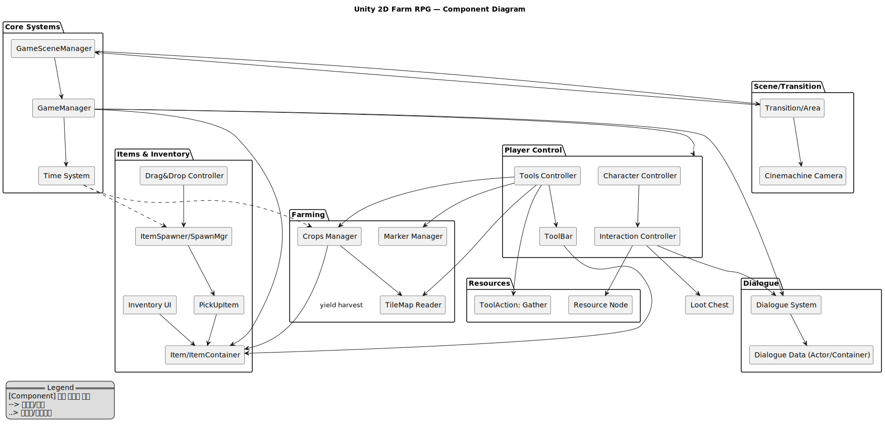
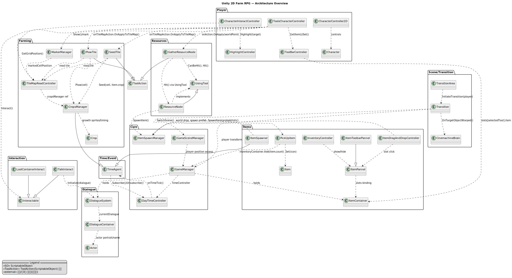

# 📌 개요 (Overview)

**프로젝트명**: Unity 2D Farm RPG (농사·채집·대화 프로토타입)<br>
**한 줄 소개**: “**타일 기반 농사 + 자원 채집 + 대화 시스템**을 데이터 주도 설계(ScriptableObject)로 모듈화하고, **툴바/인벤토리/타임 시스템**으로 플레이 루프를 완성한 2D 탑다운 RPG.”

## 🎯 설계 목표

* **플레이 루프 완결성**: 이동→상호작용→농사/채집→아이템 수집→인벤토리/툴 사용→성장/대화→지역 이동까지 **한 줄로 이어지는 루프**.
* **데이터 주도 설계**: 작물/아이템/배우(Actor)/대화 등은 **ScriptableObject**로 정의해 **에디터 친화적**(디자이너 협업 용이).
* **모듈화 & 확장성**: 툴 액션(`ToolAction`)·타일 읽기(`TileMapReadController`)·자원 노드(`ResourceNode`)·시간 이벤트(`TimeAgent`)를 **분리**해 신규 기능을 **덜 건드리고 추가**.
* **UX 우선 동작**: 하이라이트·툴바 휠 전환·아이템 자동 흡수·드래그&드랍 등 **손맛/가시성**을 챙김.
* **안정적인 씬 전환**: **Additive Scene** + **Cinemachine OnTargetObjectWarped**로 워프/씬 이동 시 **카메라 튀는 현상 최소화**.

## 🧭 핵심 플레이 루프

1. **탐색/이동**: 방향키/WSAD로 이동, 마지막 이동 방향은 애니메이터 파라미터로 유지
2. **상호작용**: 시야 전방 영역 원형 탐지 → `Interactable` 하이라이트/실행
3. **툴 사용(월드)**: 툴바 선택 → `ToolAction.OnApply()`로 주변 오브젝트 타격 (예: 나무 벌목)
4. **툴 사용(타일)**: 선택 타일(`Marker`)에 Plow/Seed 적용 → `CropsManager` 성장 진행
5. **아이템 루프**: 드랍 → `PickUpItem` 자동 흡수 → `ItemContainer` 저장 → 툴바로 사용/월드 재드랍
6. **대화**: NPC 상호작용 → `DialogueSystem`(타이핑 효과+초상화)
7. **시간**: `TimeAgent` 구독 → 작물 성장 Tick/랜덤 아이템 스폰
8. **지역 이동**: `Transition/TransitionArea`로 워프/씬 전환, 플레이어 위치/카메라 자연스러운 보정

## 🧩 아키텍처 하이라이트

* **Core Singletons**: `GameManager`(전역 참조), `ItemSpawnManager`(월드 드랍), `GameSceneManager`(씬 스위칭)
* **Event 기반 시간 흐름**: `TimeAgent`가 `DayTimeController` 구독 → onTimeTick에 **작물 성장/스폰** 처리
* **툴 파이프라인**

  * 월드 오브젝트: `ToolAction.OnApply(worldPoint)` → `UsingTool`(ex. `ResourceNode`)
  * 타일 액션: `ToolAction.OnApplyToTileMap(gridPos, TileMapReadController, Item)` → `CropsManager`
  * 공통 소비 훅: `OnItemUsed(item, inventory)`로 **내구도/소모품/쿨다운** 같은 규칙 확장 용이
* **타일 기반 상호작용**: `TileMapReadController`가 스크린/월드 좌표→**타일 좌표** 변환, `MarkerManager`가 선택 타일 하이라이트
* **UX 디테일**: 휠 스크롤로 툴바 인덱스 순환, `HighlightController`로 상호작용 타겟 시각화, `PickUpItem` **자기 유도** + TTL 관리

---

# ✨ 주요 기능 (Features)

> 각 기능은 **플레이 관점 → 기술 관점(클래스/흐름) → 확장 포인트/엣지 케이스** 순으로 정리.

## 1) 캐릭터 이동 & 상호작용

**플레이**: 이동하면서 근처 상호작용 대상에 하이라이트가 켜지고, 마우스/키 조작으로 대화/채집/상자열기 등을 실행.

**기술**

* 이동/애니메이션: `CharacterController2D`

  * `Input.GetAxisRaw()`로 벡터 입력 → `Rigidbody2D.velocity` 반영
  * `lastMotionVector` 저장 → 정지 상태에서도 **마지막 바라보기 방향** 유지(대화/툴 사용 시 UX ↑)
* 상호작용: `CharacterInteractController`

  * **전방 오프셋 + 원형 탐지(OverlapCircleAll)** → `Interactable` 검색
  * `HighlightController`로 타겟 표시, 우클릭으로 `Interactable.Interact(character)` 호출

**확장/엣지**

* 상호작용 **우선순위(거리/각도/태그)** 옵션화
* 인터랙션 범위/레이어 **프로파일**로 분리 (전투/농사 모드 전환 등)

---

## 2) 농사(Plow→Seed→Grow→Harvest)

**플레이**: 괭이로 밭을 갈고, 씨앗을 심으면 시간이 지날수록 스프라이트가 성장 단계별로 바뀌며, 수확 타이밍을 제공.

**기술**

* 데이터: `Crop`(성장 총 시간, 단계별 시간·스프라이트, 수확 산출물/개수)
* 타일 액션: `PlowTile`, `SeedTile` (둘 다 `ToolAction` 상속)

  * `PlowTile`: 허용 타일만(`canPlow`) 밭갈기 → `CropsManager.Plow()`로 **CropTile 생성 + 타일맵 변경**
  * `SeedTile`: `CropsManager.Check()`로 밭 여부 확인 후 **씨앗 심기**, `OnItemUsed()`로 씨앗 소모
* 시간 이벤트: `CropsManager : TimeAgent`

  * `onTimeTick`에서 `growTimer/growStage` 진행, 단계별 스프라이트 적용
  * **완전 성장** 시 `crop = null`로 다음 상태(수확/제거) 전환 준비

**확장/엣지**

* **계절/수분/비료/병충해** 파라미터 추가 (성장 가중치)
* 수확 액션(예: 낫) 별도로 분리, 루팅 보상 `Item` 다변화
* **동시 타일 갱신** 시 타일맵 드로우 콜/오브젝트 풀 고려

---

## 3) 자원 채집(Tree/Ore 등)

**플레이**: 도끼/픽 등 맞는 도구로 노드를 타격하면 아이템이 뿌려지고, 노드는 파괴됨.

**기술**

* 노드: `ResourceNode : UsingTool`

  * `nodeType(Tree/Ore)`에 따라 `GatherResourceNode.canHitNodesOfType`과 매칭
  * `Hit()` → **랜덤 스프레드**로 드랍 산포 → `ItemSpawnManager.SpawnItem()`
* 툴 액션: `GatherResourceNode : ToolAction`

  * 전방 원형 탐지 → `UsingTool` 가져와 `CanBeHit()` 체크 → `Hit()` 실행

**확장/엣지**

* **노드 내구도/상태 머신**(깨짐 단계), 리스폰 타이머
* 도구 \*\*등급(목/석/철)\*\*에 따른 효율/가능 여부
* 드랍 테이블 **확률 가중치**/희귀 드랍

---

## 4) 아이템·인벤토리·툴바

**플레이**: 아이템이 바닥에 떨어지고, 근처면 자동으로 빨려 들어와 인벤토리에 쌓인다. `I`로 인벤토리 토글, 휠로 툴바 스왑, 슬롯 드래그/드랍으로 정리하거나 바닥에 버릴 수 있다.

**기술**

* 데이터: `Item`(stackable, icon, onAction/onTileMapAction/onItemUsed, 연결 작물 `crop`)
* 저장: `ItemContainer` + `ItemSlot`

  * 스택/비스택 **분기**가 구현되어 있음 (슬롯 검색, 카운트 증감/클리어)
* 습득: `PickUpItem`

  * 플레이어와 **거리 임계** 내면 `MoveTowards()`로 흡수, TTL 지나면 소멸
  * `GameManager.inventoryContainer.Add(item,count)`
* UI/조작:

  * `InventoryController`(I키로 Panel/Toolbar 토글)
  * `ItemPannel`/`ItemToolbarPannel`(버튼-슬롯 바인딩, 선택 하이라이트)
  * `ItemDragAndDropController`(마우스 따라다니는 아이콘, **UI 밖 클릭 시 월드 드랍**)
  * `ToolBarController`(휠 입력으로 인덱스 순환, `GetItem` 제공)

**확장/엣지**

* 장비/툴 내구도(`OnItemUsed`) 실제 감소, 스택 분할(Split)
* 아이템 설명 툴팁/퀵슬롯 키 매핑(1\~0)
* 인벤토리 **정렬/필터**(소비/재료/퀘스트)

---

## 5) 대화 시스템

**플레이**: NPC에 접근해 상호작용하면 **타이핑 효과**로 대사가 출력되고, **배우 이름/초상화**가 함께 표시된다.

**기술**

* 데이터: `Actor`(이름/초상화), `DialogueContainer`(대사 라인 배열)
* 로직: `DialogueSystem`

  * 클릭으로 **타이핑 스킵 → 다음 라인**
  * `Initialize()`에서 UI 열고 `UpdatePortrait()`로 배우 정보 갱신
* 진입: `TalkInteract : Interactable`가 `GameManager.dialogueSystem.Initialize(dialogue)` 호출

**확장/엣지**

* **분기/선택지**, 변수 치환(플레이어 이름, 인벤토리 체크), 퀘스트 트리거
* 대사 로그/Auto-Advance/스킵

---

## 6) 씬/지역 전환 & 카메라

**플레이**: 특정 구역에 들어가면 워프하거나, 다른 씬으로 자연스럽게 이동.

**기술**

* 트리거: `TransitionArea`(Player 태그 감지 후 상위 `Transition` 호출)
* 전환: `Transition`

  * **Warp**: 자식 Transform 목적지 좌표로 이동 + `CinemachineBrain.ActiveVirtualCamera.OnTargetObjectWarped()` 호출로 카메라 보정
  * **Scene**: `GameSceneManager.SwitchScene()`(Additive Load/Unload) + 목표 좌표 배치, 카메라 보정

**확장/엣지**

* 씬 페이드, 포스트 프로세싱 전환
* **세이브 포인트**/리스폰 지점 관리

---

## 7) 시간 시스템 & 월드 이벤트

**플레이**: 시간이 흐르며 작물이 성장하고, 가끔씩 자원이 떨어진다.

**기술**

* 구독자: `TimeAgent`(임의 오브젝트가 쉽게 `onTimeTick`을 **구독/해지**)
* 발행자: `DayTimeController`(코드 외부) — `GameManager.timeController.Subscribe/Unsubscribe`
* 소비처: `CropsManager`(성장), `ItemSpawner`(확률 스폰)

**확장/엣지**

* **낮/밤/날씨/계절** 파라미터로 시스템 전반 가중치 적용
* 틱 주기/부하 분산(대량 타일/오브젝트)

---

## 8) 상자/오브젝트 상호작용

**플레이**: 상자를 열면 외형이 바뀐다. (루팅 기능은 후속 확장)

**기술**

* `LootContainerInteract : Interactable`

  * 최초 상호작용 시 **닫힘→열림** 상태 전환(프리팹 스왑)

**확장/엣지**

* 인벤토리 연동(상자 컨테이너), 잠금/키 시스템, 드랍 테이블

---

# 🖼 권장 스크린샷 & 시연 영상 컷 


1. **메인 루프 콤보 컷**

   * ① 밭갈기 Marker 하이라이트, ② 씨앗 심은 직후, ③ 성장 단계 비교(스프라이트 변화), ④ 수확 아이템 드랍/흡수
2. **채집 컷**

   * 도끼로 나무 타격 직후 목재 드랍이 주변에 뿌려지는 장면(산포 보이게)
3. **인벤토리/툴바**

   * I 키로 토글된 인벤토리 + 드래그 중 아이콘, 휠로 툴바 슬롯 하이라이트 이동
4. **대화 UI**

   * 배우 초상화/이름/타이핑 효과가 드러나는 프레임
5. **씬/워프 전환**

   * 전환 지점(Trigger)과 이동 직후 카메라 안정적으로 붙는 컷(전환 전/후)

**시연 영상 시나리오**
`마을 → 밭 워프 → Plow/Seed → NPC 대화 → 타임 스킵(성장 확인) → ResourceNode 채집 → 아이템 자동 흡수 → 인벤 정리/월드 드랍 → 다른 지역으로 씬 전환`

---

## 🏗 아키텍처 개요

이 프로젝트의 전체 구조는 **플레이어 루프**, **월드 시스템**, **아이템 루프**, **코어 매니저** 네 가지 축을 중심으로 모듈화되어 있다.
아래 컴포넌트 다이어그램은 주요 시스템 간의 관계와 데이터/이벤트 흐름을 한눈에 보여준다.

📊 다이어그램:


---

### 🎮 플레이어 루프

* **입력 기반 제어**: `CharacterController2D`가 이동과 애니메이션을 담당
* **상호작용**: `CharacterInteractController`가 주변 `Interactable` 오브젝트 탐지 → `TalkInteract`, `LootContainerInteract`, `ResourceNode`와 연결
* **툴 사용**: `ToolsCharacterController`가 툴바(`ToolBarController`)에서 선택된 아이템을 바탕으로

  * 월드 액션(`GatherResourceNode`)
  * 타일 액션(`PlowTile`, `SeedTile`) 실행
* **결과**: 작물 심기/성장, 자원 채집, 대화 시작, 상자 열기 등 플레이 루프가 완결됨

---

### 🌍 월드 시스템

* **농사 시스템**:

  * `CropsManager`가 `TimeAgent`를 통해 시간 이벤트를 구독
  * Plow/Seed 액션 결과를 타일맵(`TileMapReadController`)에 반영
  * `MarkerManager`가 선택 타일을 시각적으로 표시
* **자원 시스템**:

  * `ResourceNode`(나무/광석)가 `GatherResourceNode` 툴 액션에 반응
  * `Hit()` 호출 시 `ItemSpawnManager`를 통해 아이템 드랍

---

### 🎒 아이템 루프

* **드랍**: `ItemSpawner`나 `ResourceNode`에서 `ItemSpawnManager`를 통해 월드에 `PickUpItem` 생성
* **습득**: 플레이어 접근 시 `PickUpItem`이 자동으로 인벤토리(`ItemContainer`)에 아이템을 추가
* **관리**: `InventoryController`로 인벤토리/툴바 UI를 토글, `ItemPannel`과 `ItemToolbarPannel`로 슬롯/버튼 표시
* **조작**: `ItemDragAndDropController`로 드래그·드랍 및 월드 재배치 지원
* **사용/소모**: 툴바 선택 → `ToolAction.OnApply()` 실행 → 필요 시 `OnItemUsed()`로 소모 처리

---

### 🛠 코어 매니저

* **GameManager**: 전역 단일 진입점, Player/Inventory/Dialogue/TimeController를 보관
* **GameSceneManager**: 씬 전환 담당 (Additive 로딩 + 플레이어 위치 갱신)
* **TimeAgent / DayTimeController**: 주기적 Tick 이벤트 발행 및 구독, 작물 성장·아이템 스폰 등 처리
* **ItemSpawnManager**: 전역 아이템 드랍 관리, Prefab 기반 `PickUpItem` 소환


---

## 🛠 대표 코드 스니펫

### 1) 작물 성장 관리 (`CropsManager.cs`)

```csharp
private void Tick()
{
    foreach (CropTile cropTile in crops.Values)
    {
        if(cropTile.crop == null) continue;

        cropTile.growTimer += 1;

        if(cropTile.growTimer >= cropTile.crop.growthStageTime[cropTile.growStage])
        {
            cropTile.renderer.gameObject.SetActive(true);
            cropTile.renderer.sprite = cropTile.crop.sprites[cropTile.growStage];
            cropTile.growStage += 1;
        }
        if(cropTile.growTimer >= cropTile.crop.timeToGrow)
        {
            Debug.Log("자랄 준비 끝.");
            cropTile.crop = null;
        }
    }
}
```

✔ `TimeAgent`의 tick 이벤트마다 호출 → 작물 성장 단계 진행.

---

### 2) 아이템 획득 (`PickUpItem.cs`)

```csharp
private void Update()
{
    ttl -= Time.deltaTime;
    if (ttl <0) Destroy(gameObject);

    float distance = Vector3.Distance(transform.position, player.position);
    if (distance > PickUpDistance) return;

    transform.position = Vector3.MoveTowards(
        transform.position,
        player.position,
        speed * Time.deltaTime
    );

    if (distance < 0.1f)
    {
        GameManager.instance.inventoryContainer.Add(item, count);
        Destroy(gameObject);
    }
}
```

✔ 플레이어 근접 → 아이템 자동 습득, 인벤토리에 추가.

---

### 3) NPC 대화 (`DialogueSystem.cs`)

```csharp
public void Initialize(DialogueContainer dialogueContainer)
{
    Show(true);
    currentDialogue = dialogueContainer;
    currentTextLine = 0;
    CycleLine();
    UpdatePortrait();
}
```

✔ 대화 시작 시 UI 표시, 대사 라인 순차 출력, 초상화 갱신.

---

### 4) 툴 사용 (`ToolsCharacterController.cs`)

```csharp
private bool UseToolWorld()
{
    Vector2 position = rgbd2d.position + character.lastMotionVector * offsetDistance;
    Item item = toolbarController.GetItem;
    if(item == null || item.onAction == null) return false;

    bool complete = item.onAction.OnApply(position);
    if (complete && item.onItemUsed != null)
    {
        item.onItemUsed.OnItemUsed(item, GameManager.instance.inventoryContainer);
    }
    return complete;
}
```

✔ 툴바에서 선택된 아이템을 사용 → 월드/타일에 툴 액션 적용.

---

## 🔮 향후 개선 방향

* **게임 플레이 확장**: 퀘스트/스토리 추가, 몬스터 전투 등 RPG 요소 확대
* **데이터 주도 설계**: ScriptableObject 기반 DB를 확장해 더 많은 아이템/작물/NPC 관리
* **세이브/로드 시스템**: 플레이어 상태, 인벤토리, 월드 시간 저장/복원
* **UI 고도화**: 인벤토리 정렬, 아이템 툴팁, 대화 분기 시스템

---
